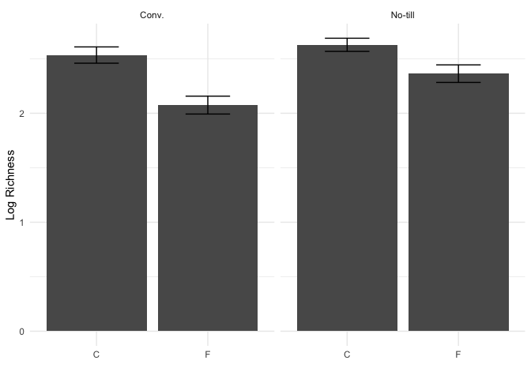
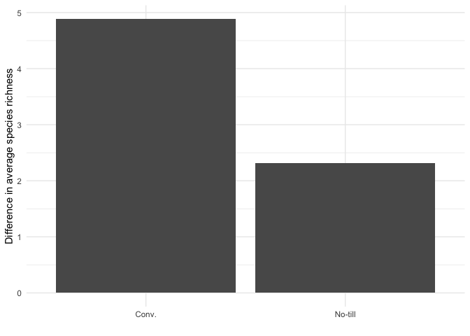

``` r
install.packages('tinytex')
tinytex::install_tinytex()
```

``` r
library(tidyverse)
```

    ## Warning: package 'ggplot2' was built under R version 4.3.2

    ## Warning: package 'tidyr' was built under R version 4.3.2

    ## ── Attaching core tidyverse packages ──────────────────────── tidyverse 2.0.0 ──
    ## ✔ dplyr     1.1.4     ✔ readr     2.1.5
    ## ✔ forcats   1.0.0     ✔ stringr   1.5.1
    ## ✔ ggplot2   3.5.1     ✔ tibble    3.2.1
    ## ✔ lubridate 1.9.3     ✔ tidyr     1.3.1
    ## ✔ purrr     1.0.2     
    ## ── Conflicts ────────────────────────────────────────── tidyverse_conflicts() ──
    ## ✖ dplyr::filter() masks stats::filter()
    ## ✖ dplyr::lag()    masks stats::lag()
    ## ℹ Use the conflicted package (<http://conflicted.r-lib.org/>) to force all conflicts to become errors

``` r
getwd()
```

    ## [1] "/Users/temitopefolorunso/Desktop/PLPA6820_CodeAss"

``` r
microbiome.fungi <- read.csv("Data_Folder/Bull_richness.csv")
str(microbiome.fungi)
```

    ## 'data.frame':    287 obs. of  16 variables:
    ##  $ SampleID       : chr  "Corn2017LeafObjective2Collection1T1R1CAH2" "Corn2017LeafObjective2Collection1T1R1CBA3" "Corn2017LeafObjective2Collection1T1R1CCB3" "Corn2017LeafObjective2Collection1T1R1FAC3" ...
    ##  $ Crop           : chr  "Corn" "Corn" "Corn" "Corn" ...
    ##  $ Objective      : chr  "Objective 2" "Objective 2" "Objective 2" "Objective 2" ...
    ##  $ Collection     : int  1 1 1 1 1 1 1 1 1 1 ...
    ##  $ Compartment    : chr  "Leaf" "Leaf" "Leaf" "Leaf" ...
    ##  $ DateSampled    : chr  "6/26/17" "6/26/17" "6/26/17" "6/26/17" ...
    ##  $ GrowthStage    : chr  "V6" "V6" "V6" "V6" ...
    ##  $ Treatment      : chr  "Conv." "Conv." "Conv." "Conv." ...
    ##  $ Rep            : chr  "R1" "R1" "R1" "R1" ...
    ##  $ Sample         : chr  "A" "B" "C" "A" ...
    ##  $ Fungicide      : chr  "C" "C" "C" "F" ...
    ##  $ Target_organism: chr  "Fungi" "Fungi" "Fungi" "Fungi" ...
    ##  $ Location       : chr  "Kellogg Biological Station" "Kellogg Biological Station" "Kellogg Biological Station" "Kellogg Biological Station" ...
    ##  $ Experiment     : chr  "LTER" "LTER" "LTER" "LTER" ...
    ##  $ Year           : int  2017 2017 2017 2017 2017 2017 2017 2017 2017 2017 ...
    ##  $ richness       : int  9 6 5 7 4 2 3 8 4 4 ...

## Data Exploration

### Select Function select() to select the column you are interested in your data.

``` r
microbiome.fungi2 <- select(microbiome.fungi, SampleID, Crop, Compartment:Fungicide, richness)
```

### Subsetting/filtering data (i.e., selecting certain rows)

using filter function filter()

``` r
head(filter(microbiome.fungi2, Treatment == "Conv."))
```

    ##                                    SampleID Crop Compartment DateSampled
    ## 1 Corn2017LeafObjective2Collection1T1R1CAH2 Corn        Leaf     6/26/17
    ## 2 Corn2017LeafObjective2Collection1T1R1CBA3 Corn        Leaf     6/26/17
    ## 3 Corn2017LeafObjective2Collection1T1R1CCB3 Corn        Leaf     6/26/17
    ## 4 Corn2017LeafObjective2Collection1T1R1FAC3 Corn        Leaf     6/26/17
    ## 5 Corn2017LeafObjective2Collection1T1R1FBD3 Corn        Leaf     6/26/17
    ## 6 Corn2017LeafObjective2Collection1T1R1FCE3 Corn        Leaf     6/26/17
    ##   GrowthStage Treatment Rep Sample Fungicide richness
    ## 1          V6     Conv.  R1      A         C        9
    ## 2          V6     Conv.  R1      B         C        6
    ## 3          V6     Conv.  R1      C         C        5
    ## 4          V6     Conv.  R1      A         F        7
    ## 5          V6     Conv.  R1      B         F        4
    ## 6          V6     Conv.  R1      C         F        2

``` r
# A more complex using &
head(filter(microbiome.fungi2, Treatment == "Conv." & Fungicide == "C")) # & means addition of that data
```

    ##                                    SampleID Crop Compartment DateSampled
    ## 1 Corn2017LeafObjective2Collection1T1R1CAH2 Corn        Leaf     6/26/17
    ## 2 Corn2017LeafObjective2Collection1T1R1CBA3 Corn        Leaf     6/26/17
    ## 3 Corn2017LeafObjective2Collection1T1R1CCB3 Corn        Leaf     6/26/17
    ## 4 Corn2017LeafObjective2Collection1T1R2CAF3 Corn        Leaf     6/26/17
    ## 5 Corn2017LeafObjective2Collection1T1R2CBG3 Corn        Leaf     6/26/17
    ## 6 Corn2017LeafObjective2Collection1T1R2CCH3 Corn        Leaf     6/26/17
    ##   GrowthStage Treatment Rep Sample Fungicide richness
    ## 1          V6     Conv.  R1      A         C        9
    ## 2          V6     Conv.  R1      B         C        6
    ## 3          V6     Conv.  R1      C         C        5
    ## 4          V6     Conv.  R2      A         C        3
    ## 5          V6     Conv.  R2      B         C        8
    ## 6          V6     Conv.  R2      C         C        4

``` r
head(filter(microbiome.fungi2, Sample == "A" | Sample == "B")) # means | sample A or sample B
```

    ##                                    SampleID Crop Compartment DateSampled
    ## 1 Corn2017LeafObjective2Collection1T1R1CAH2 Corn        Leaf     6/26/17
    ## 2 Corn2017LeafObjective2Collection1T1R1CBA3 Corn        Leaf     6/26/17
    ## 3 Corn2017LeafObjective2Collection1T1R1FAC3 Corn        Leaf     6/26/17
    ## 4 Corn2017LeafObjective2Collection1T1R1FBD3 Corn        Leaf     6/26/17
    ## 5 Corn2017LeafObjective2Collection1T1R2CAF3 Corn        Leaf     6/26/17
    ## 6 Corn2017LeafObjective2Collection1T1R2CBG3 Corn        Leaf     6/26/17
    ##   GrowthStage Treatment Rep Sample Fungicide richness
    ## 1          V6     Conv.  R1      A         C        9
    ## 2          V6     Conv.  R1      B         C        6
    ## 3          V6     Conv.  R1      A         F        7
    ## 4          V6     Conv.  R1      B         F        4
    ## 5          V6     Conv.  R2      A         C        3
    ## 6          V6     Conv.  R2      B         C        8

### Creating a new colum

using mutate function mutate()

``` r
# Create a new column called logRich
head(mutate(microbiome.fungi2, logRich = log(richness))) # create new column named logRich that has the log of richness
```

    ##                                    SampleID Crop Compartment DateSampled
    ## 1 Corn2017LeafObjective2Collection1T1R1CAH2 Corn        Leaf     6/26/17
    ## 2 Corn2017LeafObjective2Collection1T1R1CBA3 Corn        Leaf     6/26/17
    ## 3 Corn2017LeafObjective2Collection1T1R1CCB3 Corn        Leaf     6/26/17
    ## 4 Corn2017LeafObjective2Collection1T1R1FAC3 Corn        Leaf     6/26/17
    ## 5 Corn2017LeafObjective2Collection1T1R1FBD3 Corn        Leaf     6/26/17
    ## 6 Corn2017LeafObjective2Collection1T1R1FCE3 Corn        Leaf     6/26/17
    ##   GrowthStage Treatment Rep Sample Fungicide richness   logRich
    ## 1          V6     Conv.  R1      A         C        9 2.1972246
    ## 2          V6     Conv.  R1      B         C        6 1.7917595
    ## 3          V6     Conv.  R1      C         C        5 1.6094379
    ## 4          V6     Conv.  R1      A         F        7 1.9459101
    ## 5          V6     Conv.  R1      B         F        4 1.3862944
    ## 6          V6     Conv.  R1      C         F        2 0.6931472

``` r
# Creating a new column which combines Crop and Treatment  
head(mutate(microbiome.fungi2, Crop_Treatment = paste(Crop, Treatment)))
```

    ##                                    SampleID Crop Compartment DateSampled
    ## 1 Corn2017LeafObjective2Collection1T1R1CAH2 Corn        Leaf     6/26/17
    ## 2 Corn2017LeafObjective2Collection1T1R1CBA3 Corn        Leaf     6/26/17
    ## 3 Corn2017LeafObjective2Collection1T1R1CCB3 Corn        Leaf     6/26/17
    ## 4 Corn2017LeafObjective2Collection1T1R1FAC3 Corn        Leaf     6/26/17
    ## 5 Corn2017LeafObjective2Collection1T1R1FBD3 Corn        Leaf     6/26/17
    ## 6 Corn2017LeafObjective2Collection1T1R1FCE3 Corn        Leaf     6/26/17
    ##   GrowthStage Treatment Rep Sample Fungicide richness Crop_Treatment
    ## 1          V6     Conv.  R1      A         C        9     Corn Conv.
    ## 2          V6     Conv.  R1      B         C        6     Corn Conv.
    ## 3          V6     Conv.  R1      C         C        5     Corn Conv.
    ## 4          V6     Conv.  R1      A         F        7     Corn Conv.
    ## 5          V6     Conv.  R1      B         F        4     Corn Conv.
    ## 6          V6     Conv.  R1      C         F        2     Corn Conv.

### Using The pipe %\>% function

it combine output of one function into input of another function,by
connecting them with

``` r
microbiome.fungi %>%
  select(SampleID, Crop, Compartment:Fungicide, richness) %>% # selecting columns
  filter(Treatment == "Conv.") %>% # subsetting to only include the conventional treatment
  mutate(logRich = log(richness)) %>% # creating a new column of the log richness
  head() # displaying the first six rows
```

    ##                                    SampleID Crop Compartment DateSampled
    ## 1 Corn2017LeafObjective2Collection1T1R1CAH2 Corn        Leaf     6/26/17
    ## 2 Corn2017LeafObjective2Collection1T1R1CBA3 Corn        Leaf     6/26/17
    ## 3 Corn2017LeafObjective2Collection1T1R1CCB3 Corn        Leaf     6/26/17
    ## 4 Corn2017LeafObjective2Collection1T1R1FAC3 Corn        Leaf     6/26/17
    ## 5 Corn2017LeafObjective2Collection1T1R1FBD3 Corn        Leaf     6/26/17
    ## 6 Corn2017LeafObjective2Collection1T1R1FCE3 Corn        Leaf     6/26/17
    ##   GrowthStage Treatment Rep Sample Fungicide richness   logRich
    ## 1          V6     Conv.  R1      A         C        9 2.1972246
    ## 2          V6     Conv.  R1      B         C        6 1.7917595
    ## 3          V6     Conv.  R1      C         C        5 1.6094379
    ## 4          V6     Conv.  R1      A         F        7 1.9459101
    ## 5          V6     Conv.  R1      B         F        4 1.3862944
    ## 6          V6     Conv.  R1      C         F        2 0.6931472

### summarising data using summarise() function

``` r
microbiome.fungi %>%
  select(SampleID, Crop, Compartment:Fungicide, richness) %>% # selecting columns
  filter(Treatment == "Conv.") %>% # subsetting to only include the conventional treatment
  mutate(logRich = log(richness)) %>% # creating a new column of the log richness
  summarise(Mean.rich = mean(logRich)) # calculating overall mean log richness within the conventionally managed treatment
```

    ##   Mean.rich
    ## 1  2.304395

``` r
microbiome.fungi %>%
  select(SampleID, Crop, Compartment:Fungicide, richness) %>% # selecting columns
  filter(Treatment == "Conv.") %>% # subsetting to only include the conventional treatment
  mutate(logRich = log(richness)) %>% # creating a new column of the log richness
  summarise(Mean.rich = mean(logRich), # calculating the mean richness, stdeviation, and standard error
            n = n(), 
            sd.dev = sd(logRich)) %>%
  mutate(std.err = sd.dev/sqrt(n))
```

    ##   Mean.rich   n    sd.dev   std.err
    ## 1  2.304395 144 0.7024667 0.0585389

### connnecting to plotting

``` r
microbiome.fungi %>%
  select(SampleID, Crop, Compartment:Fungicide, richness) %>% # selecting columns
  group_by(Treatment, Fungicide) %>% # grouping by treatment and fungicide to later calculate summary stats by group
  mutate(logRich = log(richness)) %>% # creating a new column of the log richness
  summarise(Mean.rich = mean(logRich), # calculating the mean richness, stdeviation, and standard error
            n = n(), 
            sd.dev = sd(logRich)) %>%
  mutate(std.err = sd.dev/sqrt(n)) %>%
  ggplot(aes(x = Fungicide, y = Mean.rich)) + # adding in a ggplot
  geom_bar(stat="identity") +
  geom_errorbar( aes(x=Fungicide, ymin=Mean.rich-std.err, ymax=Mean.rich+std.err), width=0.4) +
  theme_minimal() +
  xlab("") +
  ylab("Log Richness") +
  facet_wrap(~Treatment)
```

    ## `summarise()` has grouped output by 'Treatment'. You can override using the
    ## `.groups` argument.

<!-- --> \###
using Joining function

``` r
# selecting just the richness and sample ID
richness <- microbiome.fungi %>%
  select(SampleID, richness)

# selecting columns that don't include the richness
metadata <- microbiome.fungi %>% 
  select(SampleID, Fungicide, Crop, Compartment, GrowthStage, Treatment, Rep, Sample)

head(metadata)
```

    ##                                    SampleID Fungicide Crop Compartment
    ## 1 Corn2017LeafObjective2Collection1T1R1CAH2         C Corn        Leaf
    ## 2 Corn2017LeafObjective2Collection1T1R1CBA3         C Corn        Leaf
    ## 3 Corn2017LeafObjective2Collection1T1R1CCB3         C Corn        Leaf
    ## 4 Corn2017LeafObjective2Collection1T1R1FAC3         F Corn        Leaf
    ## 5 Corn2017LeafObjective2Collection1T1R1FBD3         F Corn        Leaf
    ## 6 Corn2017LeafObjective2Collection1T1R1FCE3         F Corn        Leaf
    ##   GrowthStage Treatment Rep Sample
    ## 1          V6     Conv.  R1      A
    ## 2          V6     Conv.  R1      B
    ## 3          V6     Conv.  R1      C
    ## 4          V6     Conv.  R1      A
    ## 5          V6     Conv.  R1      B
    ## 6          V6     Conv.  R1      C

``` r
head(richness)
```

    ##                                    SampleID richness
    ## 1 Corn2017LeafObjective2Collection1T1R1CAH2        9
    ## 2 Corn2017LeafObjective2Collection1T1R1CBA3        6
    ## 3 Corn2017LeafObjective2Collection1T1R1CCB3        5
    ## 4 Corn2017LeafObjective2Collection1T1R1FAC3        7
    ## 5 Corn2017LeafObjective2Collection1T1R1FBD3        4
    ## 6 Corn2017LeafObjective2Collection1T1R1FCE3        2

``` r
head(left_join(metadata, richness, by = "SampleID")) # adding the richness data to the metadata based on on the common column of sampleID
```

    ##                                    SampleID Fungicide Crop Compartment
    ## 1 Corn2017LeafObjective2Collection1T1R1CAH2         C Corn        Leaf
    ## 2 Corn2017LeafObjective2Collection1T1R1CBA3         C Corn        Leaf
    ## 3 Corn2017LeafObjective2Collection1T1R1CCB3         C Corn        Leaf
    ## 4 Corn2017LeafObjective2Collection1T1R1FAC3         F Corn        Leaf
    ## 5 Corn2017LeafObjective2Collection1T1R1FBD3         F Corn        Leaf
    ## 6 Corn2017LeafObjective2Collection1T1R1FCE3         F Corn        Leaf
    ##   GrowthStage Treatment Rep Sample richness
    ## 1          V6     Conv.  R1      A        9
    ## 2          V6     Conv.  R1      B        6
    ## 3          V6     Conv.  R1      C        5
    ## 4          V6     Conv.  R1      A        7
    ## 5          V6     Conv.  R1      B        4
    ## 6          V6     Conv.  R1      C        2

### Pivoting using pivot_longer() and pivot_wider() Function

for pivot_wider()

``` r
microbiome.fungi %>%
  select(SampleID, Crop, Compartment:Fungicide, richness) %>% # selecting columns  filter(Class == "Sordariomycetes") %>%
  group_by(Treatment, Fungicide) %>% # grouping by treatment and fungicide to later calculate summary stats by group
  summarise(Mean = mean(richness)) %>% # calculates the mean per Treatment and Fungicide
pivot_wider(names_from = Fungicide, values_from = Mean) %>% # pivot to wide format
  mutate(diff.fungicide = C - F) %>%  # calculate the difference between the means. 
  ggplot(aes(x = Treatment, y = diff.fungicide)) + # Plot it 
  geom_col() +
  theme_minimal() +
  xlab("") +
  ylab("Difference in average species richness") 
```

    ## `summarise()` has grouped output by 'Treatment'. You can override using the
    ## `.groups` argument.

<!-- -->
